# Clinic Appointment & Medical Record App

## Project Title
Clinic Appointment & Medical Record App

## Project Description
This is an Android mobile application for managing a small clinic workflow between doctors and patients.
The app allows users to register/login, browse doctors, book appointments, manage appointment status, and create/view medical records.

Main features:
1. User authentication (Login / Register)
2. Role-based flow (Doctor / Patient)
3. Appointment booking and tracking
4. Medical record creation and viewing
5. Patient and doctor profile screens
6. Onboarding screens for first-time users

## Technologies Used
1. Java
2. Android SDK
3. AndroidX
4. Room Database (local storage)
5. MVVM architecture (ViewModel + Repository)
6. RecyclerView
7. Material Components
8. Gradle (build system)

## Screenshots
### Authentication & Onboarding
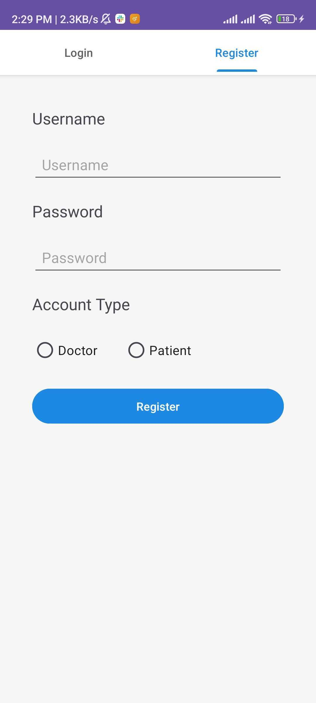
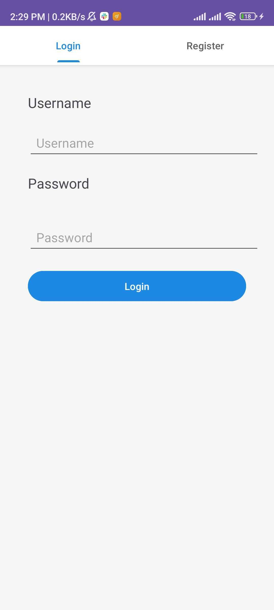
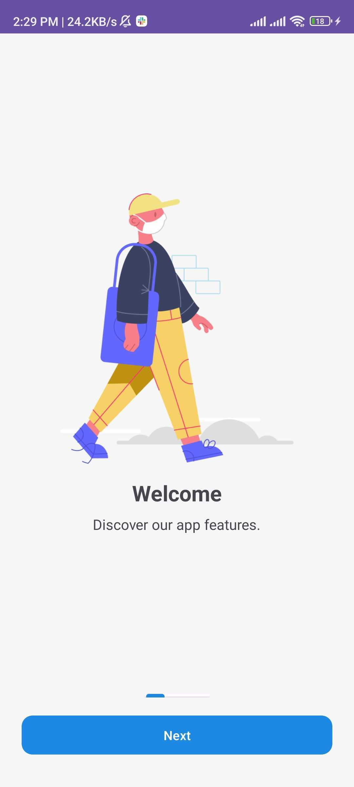
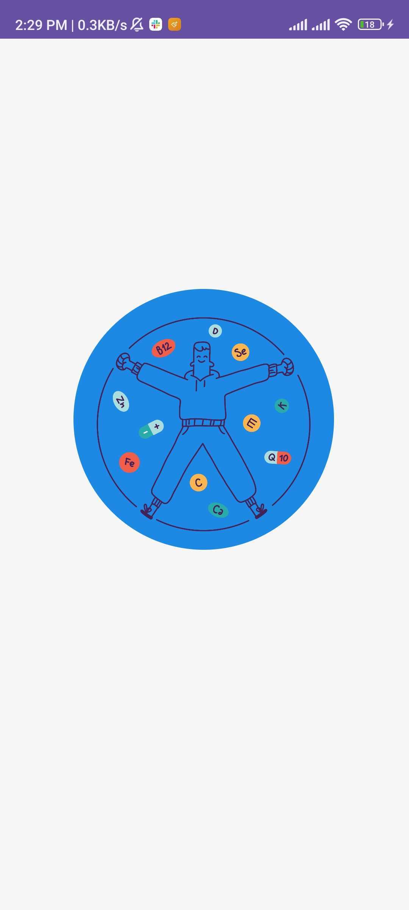

### Patient Flow
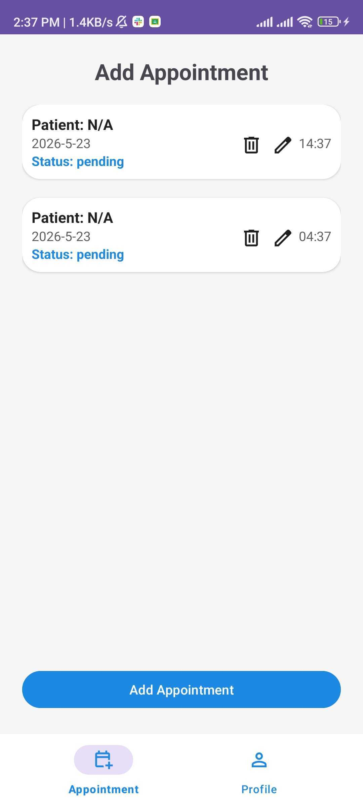
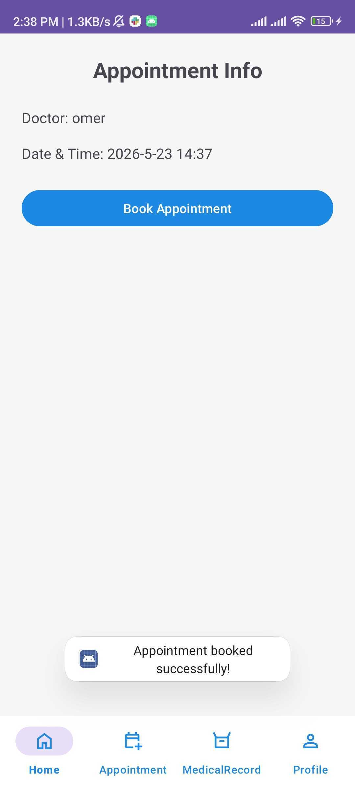
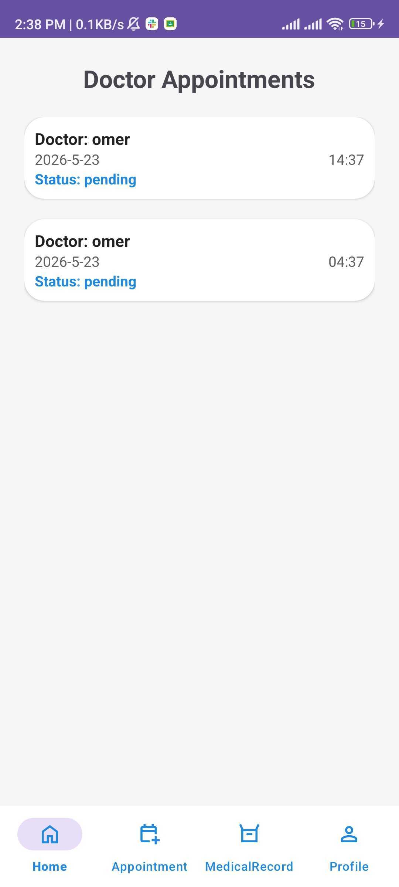
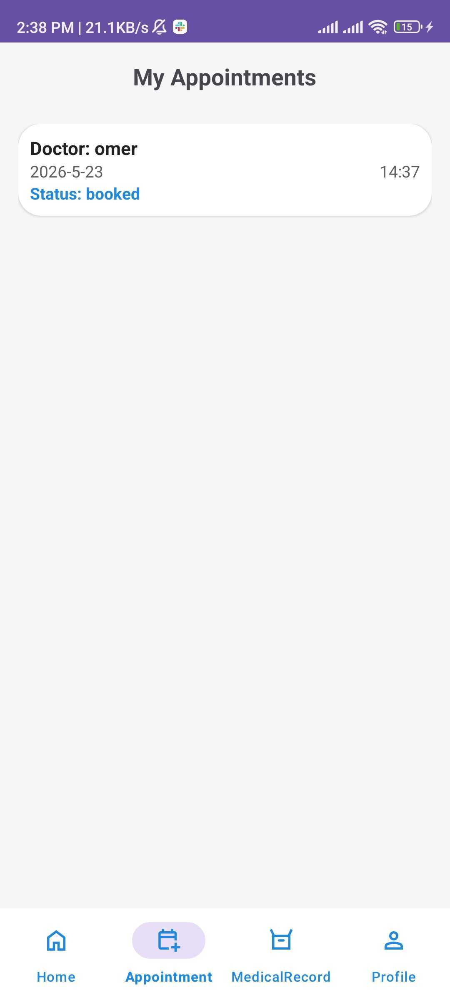

### Doctor Flow & Medical Records
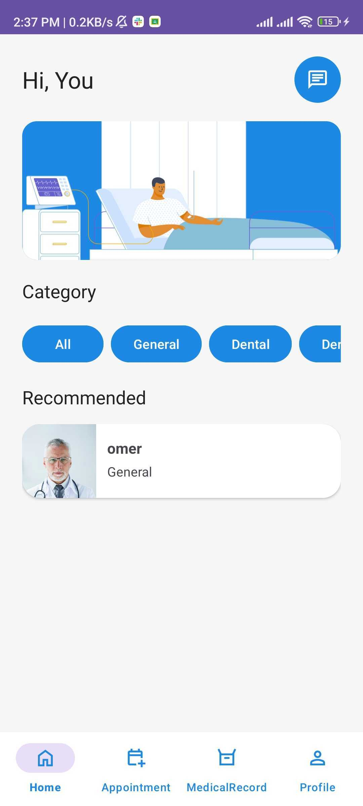
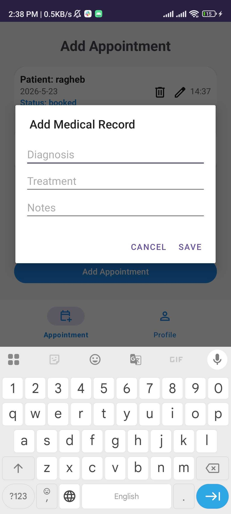
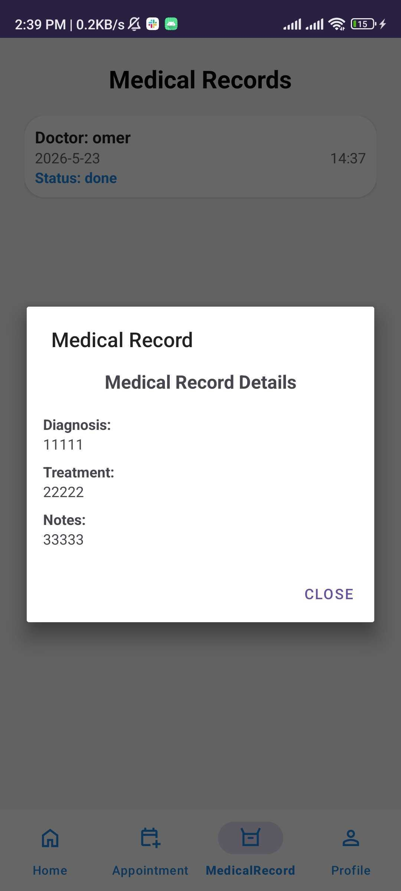
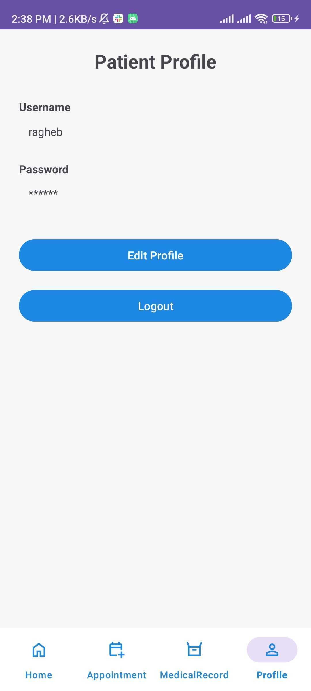

## Run Steps
1. Clone the repository:
```bash
git clone https://github.com/RaghebAbuShaban/github-training-project.git
```
2. Open the project in Android Studio.
3. Let Gradle sync and download dependencies.
4. Connect an Android device or start an emulator.
5. Run the app from Android Studio (`Run > Run 'app'`).

## Student Name
Ragheb Abu Shaban
